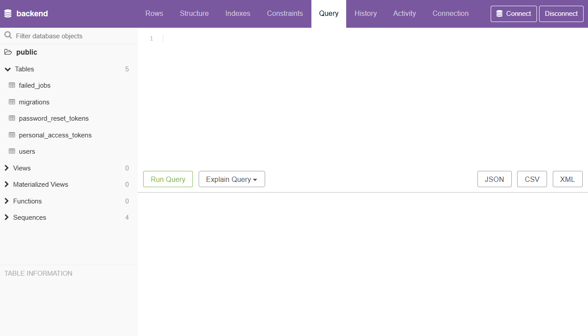
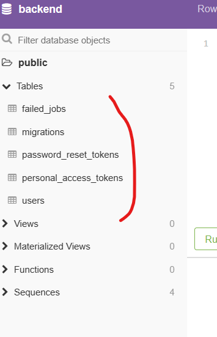
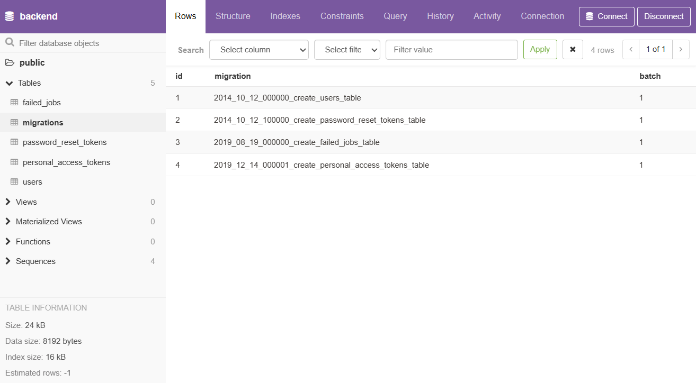
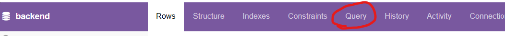
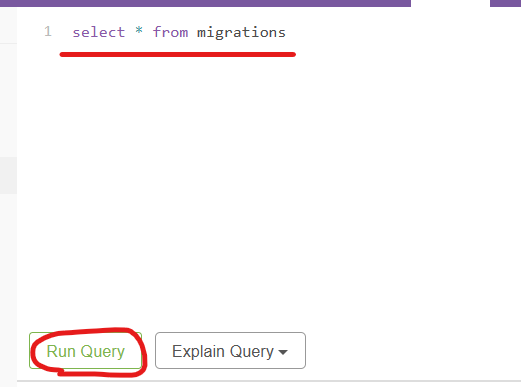
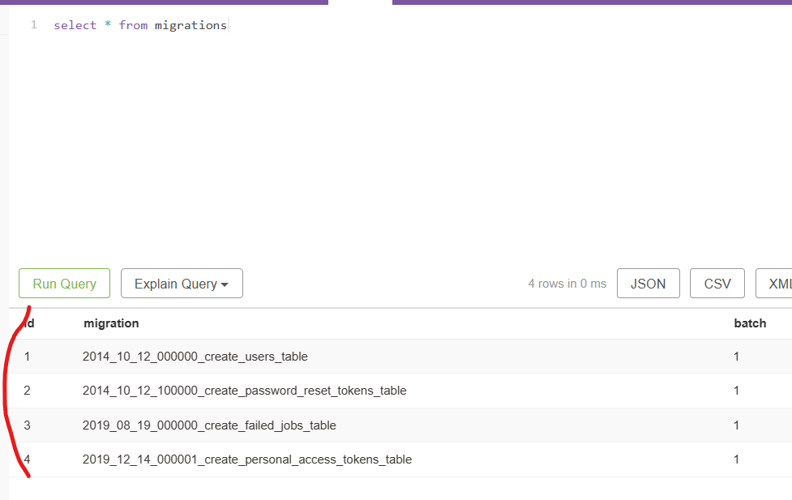

# 目次

- [Git](#git)
  - [ソースコードのダウンロード](#git-clone)
- [初期設定](#initialize)
  - [環境変数の設定](#initialize-env)
  - [開発コンテナの作成と準備](#initialize-container-setup)
  - [開発コンテナの停止](#initialize-container-stop)
- [VSCode](#vscode)
  - [拡張機能のインストール](#vscode-extensions)
- [開発](#develop)
- [pgweb の操作方法](#pgweb)
  - [表示](#pgweb-login)
  - [テーブルの内容を確認する](#pgweb-show-table)
  - [SQL の実行](#pgweb-execute-sql)

<a id="git"></a>

# Git

<a id="git-clone"></a>

## ソースコードのダウンロード

Ubuntu(WSL) 環境のターミナルを開き、任意のディレクトリで以下のコマンドを実行します。

```bash
git clone <このリポジトリのURL>
code <リポジトリ名>
```

VSCode 起動後は[拡張機能のインストール](#vscode-extensions)を行ってください。

<a id="initialize"></a>

# 初期設定

以降、`git clone`してきたローカルリポジトリのディレクトリで作業を行ってください。

<a id="initialize-env"></a>

## 環境変数の設定

以下のコマンドを実行し、必要な環境変数を設定します。

```bash
# backend/.env ファイルの生成
cp backend/.env.example backend/.env
```

生成した `backend/.env` を編集し、以下を必ず設定してください（空欄不可）。

- 必須
  - `POSTGRES_PASSWORD`（PostgreSQL のパスワード）
  - `ADMIN_PASS`（Django 管理ユーザーのパスワード）
  - `JWT_SECRET_KEY` は `openssl rand -hex 32` で生成

例:

```env
ADMIN_USER=admin
ADMIN_PASS=adminpass123

POSTGRES_DB=technical-training-database
POSTGRES_USER=user
POSTGRES_PASSWORD=devpass123
POSTGRES_HOST=pgsql
POSTGRES_PORT=5432

JWT_SECRET_KEY=$(openssl rand -hex 32 の結果)
```

すでにコンテナ/ボリュームを起動済みで `.env` を変更した場合は、初期化し直してください（ローカルDBデータは削除されます）。

```bash
docker compose down -v
docker compose up -d --build
```

<a id="initialize-container-setup"></a>

## 開発コンテナの作成と準備

docker を起動後に以下のコマンドを実行し、開発コンテナを作成、起動します。

```bash
docker compose up -d
```

`Ctrl + Shift + P`を押下し、`Dev Containers: Attach to Running Container...`を選択後、`backend`及び`frontend`を選択して開発コンテナに入ります。

以下のコマンドを入力してワークスペースを開きます。

```bash
code /app
```

コンテナ内で推奨の[拡張機能をインストール](#vscode-extensions)を行ってください。

起動後は以下の URL に接続できますので、実際にアクセスして確認してください。

- frontend: http://localhost:3000
- backend: http://localhost:8000
- pgweb(DB 管理): http://localhost:8081

<a id="initialize-container-stop"></a>

## 開発コンテナの停止

以下のコマンドを実行します。

```bash
docker compose down
```

<a id="vscode"></a>

# VSCode

<a id="vscode-extensions"></a>

## 拡張機能のインストール

VSCode が起動したら右下に画像のような通知が表示されるため、「インストール」を選択します。  


> **Note**
>
> ### 通知が表示されない・通知を閉じてしまった場合
>
> 1. `Shift + Ctrl + P` を押下し、テキストボックスに `recommend` と入力します。
> 2. 「拡張機能: お勧めの拡張機能を表示」を選択します。
>
>    または `Shift + Ctrl + X` を押下し、テキストボックスに `@recommended` と入力します。
>    
>
> 3. 表示された拡張機能をすべてインストールしてください。

<a id="develop"></a>

# 開発

以下を参考に開発を行ってください。

- [Next.js の開発について](https://nextjs.org/)
- [Django の開発について](https://docs.djangoproject.com/ja/5.2/)
  - ディレクトリ構成
    - [project (zenn)](https://zenn.dev/tigrebiz/articles/python-django-tutorial#%E3%83%97%E3%83%AD%E3%82%B8%E3%82%A7%E3%82%AF%E3%83%88%E3%82%92%E4%BD%9C%E6%88%90%E3%81%99%E3%82%8B)
    - [app (zenn)](https://zenn.dev/tigrebiz/articles/python-django-tutorial#polls-%E3%82%A2%E3%83%97%E3%83%AA%E3%82%B1%E3%83%BC%E3%82%B7%E3%83%A7%E3%83%B3%E3%82%92%E3%81%A4%E3%81%8F%E3%82%8B)
  - [django-admin と manage.py](https://docs.djangoproject.com/ja/5.2/ref/django-admin/)
  - [ルーティング](https://docs.djangoproject.com/ja/5.2/topics/http/urls/)
  - [コントローラ(View)](https://docs.djangoproject.com/ja/5.2/topics/class-based-views/intro/)
  - [データベース](https://docs.djangoproject.com/ja/5.2/ref/databases/#postgresql-notes)
    - [マイグレーション](https://docs.djangoproject.com/ja/5.2/topics/migrations/)
    - [モデル](https://docs.djangoproject.com/ja/5.2/topics/db/models/)
    - シーダー
      - [フィクスチャ](https://docs.djangoproject.com/ja/5.2/howto/initial-data/)
      - [カスタムコマンドによるシーダー (qiita)](https://qiita.com/shun198/items/14bac6843a2459b34a34)

[frontend/src/app/sample/page.tsx](http://localhost:3000/sample) に API 通信のサンプルを実装してあるため、こちらも参考程度に目を通しておいてください。

<a id="pgweb"></a>

# pgweb の操作方法

<a id="pgweb-login"></a>

## 表示

http://localhost:8081 に接続すると以下の画面が表示されます。  


<a id="pgweb-show-table"></a>

## テーブルの内容を確認する

1. 画面左メニュー `Tables` から参照したいテーブルを選択します。  
   
1. 選択したテーブルに登録されているデータが表示されます。  
   

<a id="pgweb-execute-sql"></a>

## SQL の実行

1. ヘッダメニューから `Query` を選択します。  
   
1. SQL を入力し `Run Query` をクリックします。  
   
1. 実行結果が画面下部に表示されます。  
   
